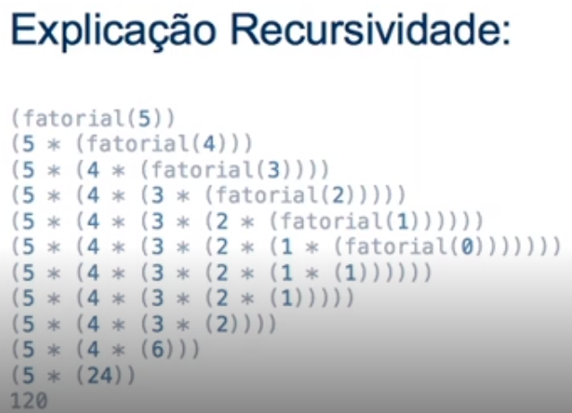
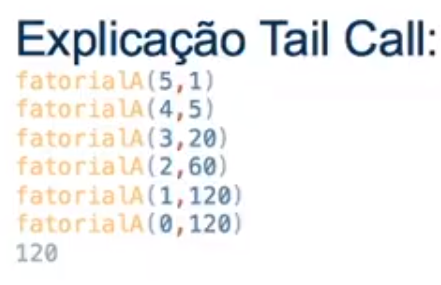

# Java avançado

## Paradigma Imperativo

  - É imperativa: os comandos / ordens vão sendo executados linha a linha
    
  - Controle do estado dos objetos em cada linha executada

  - [Imperativo.java](src/main/java/br/com/marcia/aula1/Imperativo.java)

## Paradigma Funcional

  - [Composição de funções](src/main/java/br/com/marcia/aula1/ComposicaoDeFuncoes.java)

  - [Funções puras](src/main/java/br/com/marcia/aula1/FuncoesPuras.java)
    - Retorna sempre o mesmo valor
      
  - Evita compartilhamento de estados, dados mutáveis e efeitos colaterais
    - [Princípio da Imutabilidade](src/main/java/br/com/marcia/aula1/Imutabilidade.java)
    
  - É declarativo: declara o que tem que fazer
    
  - [Funcional.java](src/main/java/br/com/marcia/aula1/Funcional.java)

  - [Interface funcional](src/main/java/br/com/marcia/aula1/Aula.java)
    - só pode ter um método a ser implementado
    - pode ter método default 
    - @FunctionalInterface é opcional
    
  - Interfaces       
    - Antes do Java 8 era necessário criar com classe anônima
      - Criar a interface [Funcao](src/main/java/br/com/marcia/aula1/Funcao.java) e depois [instanciar e implementar](src/main/java/br/com/marcia/aula1/FuncaoComClasseAnonima.java)
      - Verbosidade  
      - Código mais complexo  
    - Java 8: Interface funcional, lambda 
      - InterfaceFuncional nomeVariavel = parametro -> logica
      - [FuncaoComLambda](src/main/java/br/com/marcia/aula1/FuncaoComLambda.java) 
    
  - Recursividade
    
    - [FatorialRecursivo.java](src/main/java/br/com/marcia/aula1/FatorialRecursivo/FatorialRecursivo.java)
      - Empilha as chamadas e depois desempilha
      

    - Tail Call (recursividade em cauda): [FatorialTailCall.java](src/main/java/br/com/marcia/aula1/FatorialRecursivo/FatorialTailCall.java)
      - Já vai resolvendo a recursão, armazenando o resultado em uma variável temp
      - Trabalha com uma cópia dos valores para fazer o processamento
      - Nenhum tipo de processamento a ser feito após a chamada recursiva
      - A JVM não suporta a recursão em cauda e lança estouro de pilha (StackOverFlow) 
      
    
    - Memorization: [FatorialMemorization.java](src/main/java/br/com/marcia/aula1/FatorialMemorization.java)
      - Técnica de otimização que consiste no cache do resultado de uma função, baseada nos parâmetros de entrada
      - Cache fica armazenado em um Map estático     
    
## Interfaces funcionais

  - Funções de alta ordem 
    - Função que retorna uma função OU 
    - que recebe uma função como parâmetro: [FuncaoAltaOrdem.java](src/main/java/br/com/marcia/aula2/FuncaoAltaOrdem.java)

  - Method Reference
    - Utilizar o parâmetro da forma que ele foi recebido
      
    - Exemplos:
      
      ```
      Consumer<String> imprimirUmaFrase = System.out::println;
      imprimirUmaFrase.accept("Hello World");
      
      Function<String, Integer> converterStringParaInteiro = Integer::valueOf;
      System.out.println(converterStringParaInteiro.apply("20"));

      Predicate<String> estaVazio = String::isEmpty;
      System.out.println(estaVazio.test(""));   
      
      Supplier<Pessoa> instanciaPessoa2 = Pessoa::new;
      System.out.println(instanciaPessoa2.get());
         
      ```    
    
  - Consumer: [Consumidores.java](src/main/java/br/com/marcia/aula2/Consumidores.java)
    - é uma @FunctionalInterface
    - recebe um parâmetro, retorno void
      - Consumer<String>  => Recebe String e não retorna nada

  - Function: [Funcoes.java](src/main/java/br/com/marcia/aula2/Funcoes.java)
    - é uma @FunctionalInterface
    - recebe um parâmetro, retorna algo
      - Function<String, Integer>  => Recebe String, retorna inteiro

  - Predicate: [Predicados.java](src/main/java/br/com/marcia/aula2/Predicados.java)
    - é uma @FunctionalInterface
    - recebe um parâmetro, retorna um booleano
      - Predicate<String> estaVazio

  - Supplier: [Suplidores.java](src/main/java/br/com/marcia/aula2/Suplidores.java)
    - é uma @FunctionalInterface
    - não recebe parâmetro, retorna algo
      - Supplier<Pessoa> instanciaPessoa

  - Iterações: [Iteracoes.java](src/main/java/br/com/marcia/aula2/Iteracoes.java)
    - Stream.of
    - Collectors.joining
    - filter      
    - forEach
    - map
    - stream

## Processamento Assíncrono e Paralelo: [ThreadExemplo.java](src/main/java/br/com/marcia/aula3/ThreadExemplo.java)
    
  -  Execução da API no Java 8 - [FutureExemplo.java](src/main/java/br/com/marcia/aula3/FutureExemplo.java)

  - Parallel Stream -  [ParallelStreamExemplo.java](src/main/java/br/com/marcia/aula3/ParallelStreamExemplo.java)
    
## Modularização do Java - [jigsaw-examples](https://github.com/java-modularity-examples/jigsaw-examples)
    
  - Java 9
    - Exemplo de classe do Java: [The Unsafe Class: Unsafe at Any Speed](https://blogs.oracle.com/javamagazine/post/the-unsafe-class-unsafe-at-any-speed)
      
  - Jigsaw
    - Restringir acessos

  - Modularizando a app
      
    1) Criar módulos no IntelliJ => 'File \ New \ Module'
        
    2) Cada módulo deverá ter um arquivo module-info.java => 'botão direito na pasta src do módulo \ module-info.java'
        
    3) Usar 'exports' ou 'requires' no arquivo module-info.java para exportar o módulo ou importar outros módulos

  - A partir do JDK 9, quando incluímos um arquivo module-info.java os únicos tipos acessíveis para utilização são exportados pelo módulo java.base, que contém tipos definidos nos pacotes 
    - java.lang
    - java.util, 
    - java.nio, 
    - java.time e [alguns outros](http://cr.openjdk.java.net/~mr/jigsaw/ea/module-summary.html)
    
  - Listar os módulos do Java 
      
    ```
    $ java --list-modules
    
    java.base@11.0.11
    java.compiler@11.0.11
    java.datatransfer@11.0.11
    java.desktop@11.0.11
    java.instrument@11.0.11
    java.logging@11.0.11
    //...    
    ```
    
  - [Modularidade com Java 9 — Parte 1](https://medium.com/@luksrn/modularidade-com-java-9-parte-1-d59ed346ba90)    
    
  - [Modularidade com Java 9 — Parte 2](https://medium.com/@luksrn/modularidade-com-java-9-parte-2-90b2bd262cf1)


## Referência

  - [Instrutor João Paulo Santos - Gitlab](https://github.com/jpbaterabsb/java-avancado)

